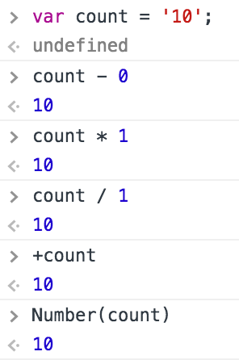

## Day 02 - JJ CAMP

#### Day 01 복습

###### 복사 VS 참조

I. 복사

* 원시데이터 유형은 복사가 된다.

* 원시 데이터(Primitive Data Type) 유형 5가지
 1. undefined (정의되지 않았다, 부정)
 2. null 	  (비어있다. 부정)
 3. Number	  (숫자형 데이터)
 4. String	  (문자형 데이터)
 5. Boolean	  (논리형 데이터)

```js
var study_name 				//undefined
var copy_sn = study_name 	//undefined가 복사됨
// 런타임 중에 다른 한쪽의 값이 바뀌더라도 값이 바뀌지 않음.

```
* 변수 초기 선언 후 런타임 중에 변수에 값을 할당할 수 있다.
* undefined, null은 부정(false)을 의미한다.

###### garbage collector  

* 참조되지 않거나 복사되지 않은 데이터를 삭제한다.  


II. 참조

* 참조는 두 변수가 하나의 값을 가리키고 있는 것
* `{}(중괄호)`로 감싸진 것들은 객체를 의미한다.
* 객체에 접근하기 위해서는 `.객체이름`으로 접근해야 한다.

```js
var mouse = {'name': 'Apple Magic Mouse'}
console.log(mouse.name);

```
  

III. 변수(Variable) VS 상수(Constant)  

* 변수는 실행 중인 상황에서 값을 변경할 수 있는 반면, 상수는 실행중인 상황에서 값을 변경할 수 없다.

* 변수와 상수를 구분하기 위한 목적으로 상수 이름은 모두 대문자로 작성 표기한다.

* 상수를 공식적으로 지원하는 것은 ECMAScript 2015버전부터이다.


###### 변수 정의 패턴

* var html = document.documentElement; -> `<html>`문서 객체 - 참조형 데이터, 값 참조
* var body = document.body; -> Legacy 방법(웹의 초창기에 사용됨. 하지만 지금도 빈번하게 사용되고 있음)

-

#### Day 02 본 수업

* attribute: 정적(HTML 속성)
* property : 동적(CSS, JS 속성)

* property(속성)를 가질 수 있는 것은 오직 객체이다.  


* 아래의 코드는 에러가 발생하게 된다.
* 그 이유는 `<script>`위치 때문이다. `<script>`가 `<body>`위에서 해석되게 되고 `var body = document.body`에서부터 객체를 찾지 못해 에러가 발생하게 된다.
* 다음 `html`코드에서 `<script>`위치를 `</body>`로 옮기게 되면 에러 없이 작동되게 된다. 

```html
<!DOCTYPE html>
<html lang="ko-KR">
<head>
	<meta http-equiv="X-UA-Compatible" content="IE=Edge">
	<meta charset="UTF-8">
	<title>자바스크립트 코어 테스트</title>
	<script src="dom-control.js"></script>
</head>
<body>
	<div id="page" lang="en">
		<h1>page element(parent)</h1>
		<div class="page-child">child element</div>
	</div>
</body>
</html>
```

```js
var html = document.documentElement, 
	body = document.body,
	page = document.getElementById('page'),
	page_headline = page.getElementsByTagName('h1'),
	page_child = page.getElementsByClassName('page-child');
```


###### 논리 유형(Boolean): 참 거짓
* 0만 아니면 참이다.(-2, -100, 3, 6 등은 참이다)
* 1: 참,	0: 거짓


#### Event Binding

*Event Binding[이벤트 바인딩]: 이벤트 속성에 함수를 연결
 
```js
document.onclick // null;

document.onclick = function(){
	console.log('clicked document object')
};
```

* 익명 함수
> var initialization = function(){}

* 기명 함수
function initialization(){}


#### 자바스크립트의 유형 변경(형 변환, Change Data Type)

###### 숫자 -> 문자  


```js

// 방법1. 앞 뒤에, 홑따옴표(''), 쌍따옴표("")를 추가
var count = '10';

var count = 10;

// 방법2. 빈 문자열 ''을 숫자 뒤에 더한다(+)
count + ''; // 10 -> '10'
// 방법3. 문자 객체가 소유한 함수(메소드)를 사용하는 경우
count.toString() // '10'
// 방법4. 문자 함수를 사용하여 숫자를 문자로 변형
String() // '10'
```

###### 문자(숫자형 문자) -> 숫자  


```js
var count = '10';

방법1. 숫자형 문자 뒤에 0을 빼거나, 1을 곱하거나 또는 1로 나눈다.
count - 0; count * 1; count / 1;

방법2. 숫자형 문자 앞에 +기호를 붙인다.
+count;

방법3. 숫자 함수에 숫자형 문자를 전달하여 실행한다.
Number(count);
```


###### 문자(단위가 붙은 문자) -> 숫자  


```js  

방법 1. parseInt()함수에 단위 유형의 문자를 전달
window.parseInt('20.3%', 10) // 결과: 20;
// parseInt()는 정수를 반환한다.

방법 2. parseFloat()함수에 단위 유형의 문자를 전달
window.parseFloat('20.3%', 10) // 결과 : 20.3
// parseFloat()는 실수를 반환한다.

```
* parseInt(), parseFloat()에서 두번째로 들어간 `10`은 10진수를 의미하며 8, 10, 16진수로 결과값을 받을 수 있다.


###### 문자 유형

```js
var me = 'I'm a Boy.'; 
```

* 다음 위에서와 같이 작성을 하게 되면, 아래와 같이 에러 메세지가 뜬다. 
.png)

* 그렇기 때문에 "I'm a Boy";로 표현하거나
Escape 처리하여 'I\'m a Boy' 표현한다.(Back Slash `\` 사용)


#### DOM(Document Object Model)

###### 문서 객체 선택 API

* 문서 객체에 접근하는 방법은 다음과 같다.

.getElementById()
.getElementsByTagName()
.getElementsByClassName()

```js
var h1_els = document.getElementsByTagName('h1'); 

var h1 = h1_els.item(0); 
// Programming에서는 시작되는 숫자 값이 0부터 이다.

h1.onclick = function() {
  console.log('this is heading 1.');
  // 클릭하면 h1 참조 객체의 font-size 값을 가져오고자 한다.
  var current_font_size = h1.style.fontSize;
  // h1.style.fontSize라고 찾게 되면, inline style 속성을 찾게 되어 결과값이 없게 된다.

  // W3C Standard Method
  current_font_size = window.getComputedStyle(h1).fontSize;

  // Microsoft Non Standard Method
  // h1.currentStyle.fontSize;


  current_font_size = window.parseInt(current_font_size, 10);

  current_font_size = current_font_size - 10;

  h1.style.fontSize = current_font_size + 'px';
};

// 참고로 수집된 집합 자체에 이벤트를 연결하면 동작하지 않는다.
h1_els.onclick = function() {
  console.log('h1_els 변수에 참조된 것은 노드리스트(집합)이기에 이 코드는 작동되지 않는다.');
};
```

